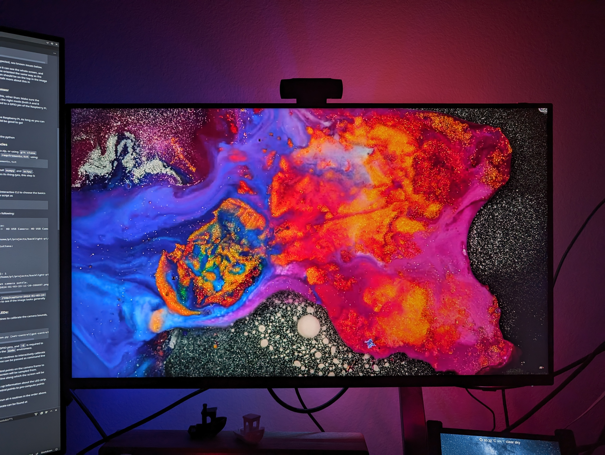

# backlight-pi

A simple program to add dynamic backlight to any screen.

## Overview

There are two implementation of backlight-pi, one in [python](./python/) and
one in [rust](./rust/).

See [python/README.md](./python/README.md) and
[rust/README.md](./rust/README.md) for instructions on how to set up the
respective implementation.

## Comparison

The two implementations are fairly similar and work effectively identically.
The main difference in the two is their performance, which affects how quickly
the LEDs react to changes on the screen.

Streaming 1080p @ 30 fps from the camera on a Raspberry Pi Zero 2W, the
backlight LEDs are updated at the following rates:
- Python: ~10 updates / s
- Rust ~17 updates / s

Rust is approx. 70% faster than the rust implementation.
