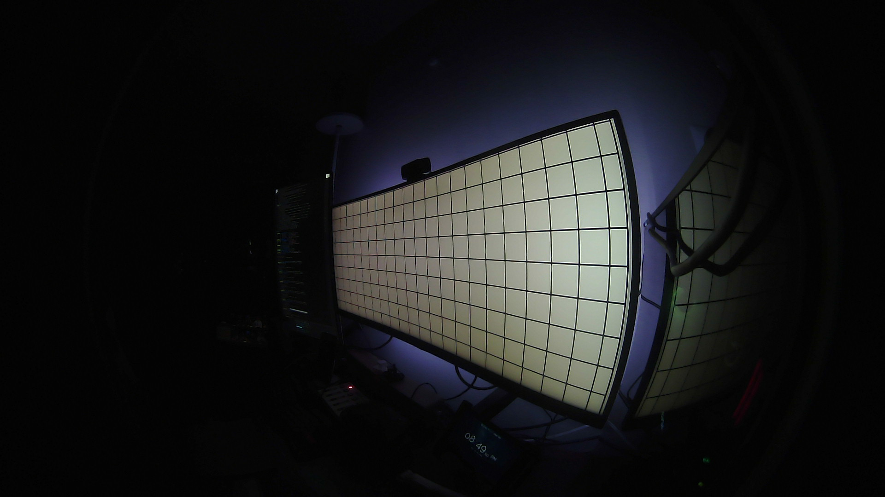
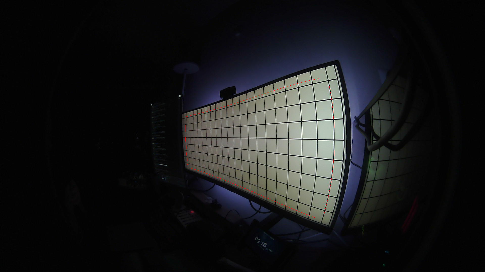

# Calibrating `backlight-pi`

`backlight-pi` needs two main pieces of information before it can used:
1. Where the screen is in the camera frame.
2. How the LED strips are set up behind the screen.

These two pieces are set through the `set-control` and `set-led` routines.
`get-control` is meant to verify the output of `set-control`.

Let's call `calibration.py` without any arguments, and  explain the different
routines as they're called.


```
$ sudo -E python calibration.py
```

## 1. `set-control`
```
Grabbing Frame for calibration
-------------------------------
/dev/video0 (1920, 1080)
Running camera stream for ~10s before capturing frame
1..2..3..4..5..6..7..8..9..
Capturing frame.
Wrote calibration image: /tmp/calibration-capture-2024-01-03-23-32-02-310335.png

Please fill out config/calibration.json and press Enter.
```

This runs the camera for ~10s and writes the final frame to the printed path.
The frame is intended to be used as a guide to provide points that will be
joined to create a spline along which the screen will be sampled.

In my case, the calibration image looks like:


Use this image to determine points near the edges of the screen that should be
sampled to set the color of the backlight.

These points must be written to `config/calibration.json` before continuing.
The anatomy of `calibration.json` is as follows:
```javascript
// NOTE: Comments for documentation only. JSON does not allow comments.
{
    "top": [
        // These must be ordered left to right,
        // i.e. x cordinates should be in increasing order
        738, 462, // x1, y1,
        815, 443, // x2, y2,
        948, 404, // x3, y3,
        1045, 372, // x4, y4,
        1264, 311 // x5, y5
    ],
    "left": [
        // These must be ordered top to bottom,
        // i.e. y cordinates should be in increasing order
        731, 476, // x1, y1,
        734, 553, // x2, y2,
        742, 654 // x3, y3
    ],
    "bottom": [
        // These must be ordered left to right,
        // i.e. x cordinates should be in increasing order
        750, 666, // x1, y1,
        866, 706, // x2, y2,
        1020, 770, // x3, y3,
        1175, 836, // x4, y4,
        1248, 864 // x5, y5
    ],
    "right": [
        // These must be ordered top to bottom,
        // i.e. y cordinates should be in increasing order
        1303, 339, // x1, y1,
        1322, 496, // x2, y2,
        1309, 729, // x3, y3,
        1282, 850 // x4, y4,
    ]
}
```

Once you have noted down the points and saved `config/calibration.json`, press
Enter and continue.

Technically, the points provided above are used to create a
[cubic spline](https://mathworld.wolfram.com/CubicSpline.html) along the edge of
the display. This spline is used as a guide to determine which points of the
image should be sampled to color the LEDs.

Some notes on choosing the control points:
- These don't have to be super precise, and as long as they generally follow
  the edge of the display, it should be fine.
- Remember to leave some space between the points and the physical edge of the
  screen as the main content on the screen is often padded in, and it provides a
  buffer if the screen or the camera moves slightly.
- Having a grid like thing on the screen will help with determining points more
  easily.
- Use the minimal number of points that gives an appropriate curve. Using more
  points does not necessarily mean a better curve.

## 2. `get-control`
```
Displaying a calibrated frame
-----------------------------
/dev/video0 (1920, 1080)
Running camera stream for ~5s before capturing frame
1..2..3..4..
Capturing frame.
Wrote calibration image: /tmp/calibration-show-2024-01-03-23-32-31-163835.png
Does the calibration frame look right?
'y' to continue, 'n' to retry: y
```

This routine draws the line along which the screen will be sampled and writes
them to the printed path. In my case, the output image looks like:


Notice the red lines towards the edges of the screen. These are the lines along
which the image will be sampled to color the LEDs.

## 3. set-led
```
Setting up LED Strips
---------------------
The following prompts will collect information about the LED strips.
```

#### LED driving pin:
```
GPIO Pin driving the LED Strip: 18
```
This is the GPIO pin connected to the data pin of the LED strip.
Note that this is the GPIO Pin number, **not** the hardware pin number.
Most Raspberry Pis have a 40-pin header, but only 27 (or 26) GPIO pins. See
[`pin_to_pin.py`](/pin_to_pin.py) for available pins.

Raspberry Pi GPIO Reference:
https://www.raspberrypi.com/documentation/computers/raspberry-pi.html#gpio-pinout


#### LED counts:
```
Count the number of LEDs on the strip on the sides of the monitor.
    Number of LEDs on the TOP edge: 44
    Number of LEDs on the BOTTOM edge: 44
    Number of LEDs on the LEFT edge: 19
    Number of LEDs on the RIGHT edge: 19
```

This step tells the program how many LEDs are present on each side. The
sides are not required to have the same number of LEDs, but there should be at
least two LEDs per side.

#### LED strip order:
```
First Strip [bottom|right|left|top]: top
Second Strip [bottom|right|left]: left
Third Strip [bottom|right]: bottom
Assuming fourth strip is 'right'.
```
Because LED strips on all sides are connected in series, this step tells
backlight-pi how the order going from closet to the driving pin to the
furthest. We will try to light up the corresponding strips in the next step.

#### LED strip orientation:
```
Testing LED strip orientation.
------------------------------
Watch for LEDs lighting up!

Testing TOP:
    Are the LED lighting up from left to right?[y|n]: n

Testing BOTTOM:
    Are the LED lighting up from left to right?[y|n]: y

Testing LEFT:
    Are the LED lighting up from top to bottom?[y|n]: y

Testing RIGHT:
    Are the LED lighting up from top to bottom?[y|n]: n
```
Now that we know the order in which the LED strips are connected, this step
checks the orientation of the LED strips. Note that "left to right" and "top
to bottom" are from the perspective of someone looking at the screen.

#### Pin to turn LEDs on/off:
```
Pin to turn LEDs on and off: 15
```
This step is intended to specify where the I/O pin of TTP223 capacitive sensor
is connected.

Technically, the LED strips will be turned off any time this pin is pulled down,
and will be turned on any time this pin is pulled up. So the TTP223 sensor can
be replaced with a toggle switch to pull the pin up or down.

## 4. Fin.
```
All calibration done. Backlight Pi should be good to go!
```
All done! The calibration information will be written to various files in
`config/`.
