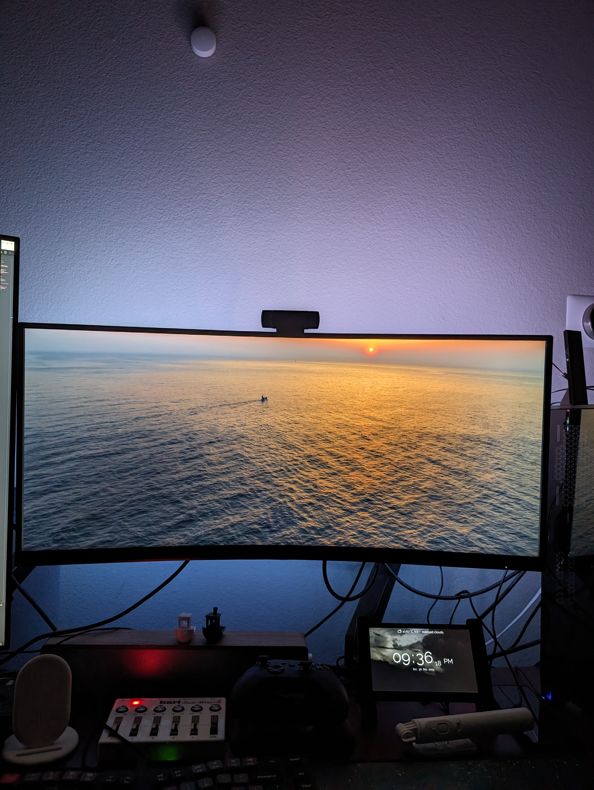

# backlight-pi

A simple program to add dynamic backlight to any screen.



## Table of contents
- [Setting Up](#setting-up)
  - [0. Get all the ingredients](#0-get-all-the-ingredients)
  - [1. Set up the LED Strip](#1-set-up-the-led-strip)
  - [2. Set up the Camera](#2-set-up-the-camera)
  - [3. Set up the Capacitive Sensor](#3-set-up-the-capacitive-sensor)
  - [4. Set up the Raspberry Pi](#4-set-up-the-raspberry-pi)
- [Configure your setup](#configure-your-setup)
  - [0. Get code and dependencies](#0-get-code-and-dependencies)
  - [1. Set up the camera:](#1-set-up-the-camera)
  - [2. Calibrate Camera and LEDs:](#2-calibrate-camera-and-leds)
  - [3. Move the generated `config` directory to the `rust` directory](#3-move-the-generated-config-directory-to-the-rust-directory)
- [Known Issues During Setup](#known-issues-during-setup)
- [Start `backlight-pi`](#start-backlight-pi)
  - [0. Install Rust](#0-install-rust)
  - [1. Build Executable](#1-build-executable)
  - [2. Run Executable](#2-run-executable)
  - [3. Fin.](#3-fin)


## Setting Up

### 0. Get all the ingredients
For this script to work, you'll need:

1. Raspberry Pi Zero 2W
2. An LED strip with WS2812B long enough to cover all 4 sides of your monitor.
3. A generic USB camera that the Raspberry can access via V4L2.
4. A TTP223 based capacitive sensor in "Self Lock / Low Output Mode".

All ingredients can be freely sub-ed for other more convenient options, but OOB
experience may be degraded.

### 1. Set up the LED Strip
This won't go into details of how to put an LED strip behind your monitor
(please figure that out for yourself), but the LED strip should meet the
following constraints:

1. All sides should be connected in series, i.e. you should be able to control
   all LEDs from a single control pin.
2. There should be no "shared" LEDs between sides, i.e. no corner LEDs that
   belong to two sides
3. There should be at least 2 LEDs per side.

Once the LED strip is set up, ***note down the number of LEDs on each side***
and connect the data line of the LED strip to a GPIO pin on the Raspberry Pi.

**NOTE:** LEDs can pull significant current. Make sure your power supply can supply
enough current to the LEDs and if connected, the Raspberry Pi.

### 2. Set up the Camera
1. Simply plug in the USB Camera to the Raspberry Pi.
2. Check if a corresponding V4L2 node (at `/dev/video*`) was created for the
   camera. V4L2 devices can also be listed by using
   ```
   $ v4l2-ctl --list-devices

   HD USB Camera: HD USB Camera (usb-3f980000.usb-1):
        /dev/video0
        /dev/video1
        /dev/media3
   ```

   If the list is longer than you expected, see known issues below.
3. Mount the camera somewhere it can see the whole screen, and won't be
   disturbed. It should be oriented the same way as the screen, i.e. the top of
   the screen should be on the top in the image captured by the camera.
   We'll talk more about this in [calibration.md](../docs/calibration.md).

### 3. Set up the Capacitive Sensor
There is no real requirements for this, other than: Make sure the sensor has
enough power, is set to the right mode (both A and B welded), and the IO pin is
connected to a GPIO pin of the Raspberry Pi.

### 4. Set up the Raspberry Pi
No extra steps needed to set up the Raspberry Pi. As long as you can
run a python script on it, you should be good to go!

## Configure your setup

**NOTE:** This and the next sections are borrowed from the [python](../python/)
implementation. The logic for setting up the various bits and pieces is still
implemented in Python and I am too lazy to port it over to Rust.

So for now python is still needed to configure your setup.

### 0. Get code and dependencies
1. Download the code: either as a zip, or using `git clone`
2. Navigate to [python](../python/)
3. Install all the requirements in [`requirements.txt`](./requirements.txt)
   using:
   ```
   pip install -r requirements.txt
   ```
   This may take a while as it install `numpy` and `scipy`.
4. Go grab a coffee while pip does its thing (yes, this step is mandatory!)


### 1. Set up the camera:
[`setup_camera.py`](./setup_camera.py) provides an interactive CLI to choose
the basics of the USB Camera. Simply run the script as
```
python setup_camera.py
```

You should see something like the following:
```
$ python setup_camera.py
Found the following device:
    [1] : /dev/video0  -->  HD USB Camera: HD USB Camera

Choose a device[1..1]: 1
Writing /dev/video0 to /home/pi/projects/backlight-pi/config/v4l2_device.txt

Found the following resolutions:
    [1] : (1920, 1080)
    [2] : (1280, 1024)
    [3] : (1280, 720)
    [4] : (1024, 768)
    [5] : (800, 600)
    [6] : (640, 480)
    [7] : (320, 240)
Choose a resolution[1..7]: 1
Writing (1920, 1080) to /home/pi/projects/backlight-pi/config/resolution.txt

Capturing 10 frames to let camera settle.
Wrote file /tmp/capture-2024-01-03-23-11-20-398497.png
```

Take a look at the created image (`/tmp/capture-2024-01-03-23-11-20-398497.png`)
in this case to see if the image looks generally okay.

### 2. Calibrate Camera and LEDs:
[`calibration.py`](./calibration.py) provides routines to calibrate the camera
bounds, and to set up the LED strips.

Run the python script as follows:
```
sudo -E python calibration.py [set-control|get-control|set-led|set-samples]
```
`sudo` is needed for controlling GPIO pins, and `-E` is required to pass your
current environment to the `sudo` environment.

`calibration.py` provides three routines to interactively calibrate the script
for a specific setup. These can be passed as command line arguments to the
script:
1. `set-control`: Sets up control points on the camera frame to determine
   the points where screen will be sampled from.
2. `get-control`: Display the line along which the screen will be sampled from.
3. `set-led`: Interactively sets up information about the LED strip.
4. `set-samples`: Uses the control points to pre-compute points that must
    be sampled

Not providing any argument will run all 4 routines in the order above.

More information on how to calibrate can be found at
[`../docs/calibration.md`](docs/calibration.md).

### 3. Move the generated `config` directory to the `rust` directory

Assuming you've already navigated to the rust directory:
```bash
mv ../python/config ./
```

## Known Issues During Setup
- **`OSError: [Errno 25] Inappropriate ioctl for device` when running
  `setup_devices.py`.**

  This happens when there are V4L2 nodes that don't correspond to USB Cameras
  and cannot be filtered by V4L2Py. It is not clear why V4L2Py cannot filter
  these out. So as a workaround, there is a mechanism for the script to ignore
  these V4L2 nodes.

  1. Get a complete list of mounted V4L2 nodes on your system:
     ```
     $ v4l2-ctl --list-devices
     bcm2835-codec-decode (platform:bcm2835-codec):
             /dev/video10
             /dev/video11
             /dev/video12
             /dev/video18
             /dev/video31
             /dev/media2

     bcm2835-isp (platform:bcm2835-isp):
             /dev/video13
             /dev/video14
             /dev/video15
             /dev/video16
             /dev/video20
             /dev/video21
             /dev/video22
             /dev/video23
             /dev/media0
             /dev/media1

     HD USB Camera: HD USB Camera (usb-3f980000.usb-1):
             /dev/video0
             /dev/video1
             /dev/media3
     ```
     In this case, `bcm2835-codec-decode` and `bcm2835-isp` are non-camera V4L2
     nodes mounted to the system that may cause the crash.

  2. Create a file `config/ignored_nodes.txt` and put all spurious V4L2 nodes
     there. For an output like above, `ignored_nodes.txt` will look something
     like:
     ```
     /dev/video10
     /dev/video11
     /dev/video12
     /dev/video13
     /dev/video14
     /dev/video15
     /dev/video16
     /dev/video18
     /dev/video20
     /dev/video21
     /dev/video22
     /dev/video23
     /dev/video31
     ```
     Note that there is no need to put `/dev/media*` files in
     `ignored_nodes.txt`.

- **LEDs are always white**:

  This can happen if the auto exposure algorithm starts acting up and tries
  to expose a darker part of the scene. The bright screen will get saturated and
  show up completely white.

  To fix this issue use manual exposure time. See `_setup_camera` function in
  `image_controller.py` for an example.


## Start `backlight-pi`
### 0. Install Rust
Rust can be installed on the Raspberry Pi from the official website:
https://www.rust-lang.org/tools/install

**Caveat:**

Raspberry Pi Zero has too little RAM to install Rust, so simply executing
the install script may lead to the RPi completely hanging. To fix this, simply
download some spare RAM from
[here](https://youtu.be/dQw4w9WgXcQ?si=2lPaj3JhJv5nXj3Q) and return it once
Rust has finished installing.

Slightly seriously: We need set some environment variables to ensure that
Rust installation does not end up consuming the entire RAM.

The following environment variables need to be set _before_ calling the Rust
install script.
```bash
export RUSTUP_UNPACK_RAM=200000000 # set max RAM usage to ~200MB (RPi has 512MB)
export RUSTUP_IO_THREADS=1         # set max thread count to 1
```

This will also take a while, so go refill your coffee.

### 1. Build Executable
Once Rust and Cargo have been installed, building the executable is as simple
as calling

```bash
cargo build --release -j1
```
`-j1` limits the number of threads used to `1`, which prevents cargo from
greedily consuming all available RAM.

Hope you didn't finish that coffee yet, because might take a while as well.

### 2. Run Executable
The `cargo build` command from previous step will generate an executable binary
at `target/release/backlight-pi`.

To run the binary, simply call
```bash
sudo ./target/release/backlight-pi
```

The `sudo` is needed to interact with the GPIO pins.

### 3. Fin.
